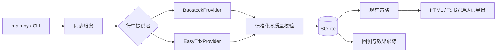

# easy_tdx 集成计划

> 状态：第一轮已实现，待执行真实网络影子校验。原作者仓库和 PyPI 入口已不可访问，但 `zliujinxin/easy-tdx` 保存了可验证的原项目提交历史。集成固定到已审计提交，不能使用浮动 `main` 或同名 PyPI 包。血缘和风险结论见 [easy-tdx-fork-audit.md](easy-tdx-fork-audit.md)，其他候选见 [market-data-replacement-plan.md](market-data-replacement-plan.md)。

更新日期：2026-09-09

## 目标

在保留 Sequoia-X 现有策略、SQLite 数据库、HTML 报告、板块/ST 筛选、飞书推送和通达信导出的基础上，引入可替换的数据源接口，并将 easy_tdx 作为候选行情源。先验证数据，再切换生产取数；回测和新策略放在后续阶段。

## 设计原则

- 策略只读取统一的 OHLCV 数据，不直接依赖 easy_tdx 或 Baostock。
- 单次同步选择一个主数据源；不同复权口径的数据不得无标记地混写。
- 新数据源先运行影子校验，未通过时不修改正式行情表。
- 所有写入继续使用 `(symbol, date)` 唯一约束，并记录来源、复权口径和抓取时间。
- 任何外部失败都保留现有可用数据，并输出明确失败原因。
- 固定可审计的依赖版本，避免跟随上游最新代码自动变化。

## 目标结构

## 功能清单与实施阶段

### 阶段 0：依赖与数据口径确认

功能：

- 从 `zliujinxin/easy-tdx` 取得保存源码，默认固定到审计提交 `7c9e19de937946d231735dabb4a275440578b753`。
- 保存提交号、源码归档 SHA-256、MIT 许可证和来源说明；禁止使用浮动分支或同名 PyPI 包。
- 建立字段映射：代码、日期、开高低收、成交量、成交额、名称、市场。
- 确认复权口径。当前 Baostock 使用 `adjustflag="1"`（后复权）；easy-tdx 使用 MAC 行情的 `Adjust.NONE/QFQ/HFQ`，影子校验按同一 `HFQ` 口径比较，不能直接混写。
- 明确在线通达信服务器和本地 `vipdoc` 两种路径的能力边界。

验收：

- 可以从可审计来源重复安装同一版本。
- 形成字段、单位、复权口径对照表。
- 未通过本阶段时，不修改正式数据库。

### 阶段 1：数据源抽象

功能：

- 新增 `MarketDataProvider` 接口。
- 将现有 Baostock 调用包装为 `BaostockProvider`，保持原有行为。
- 预留 `EasyTdxProvider`，统一返回标准 DataFrame。
- 新增配置：
  - `DATA_PROVIDER=baostock|easy_tdx`
  - `DATA_ADJUSTMENT=<明确口径>`
  - `DATA_FALLBACK_PROVIDER=<可选>`
  - easy_tdx 连接超时和候选服务器配置。
- `DataEngine` 负责存储和缓存，不再负责某个供应商的连接细节。

验收：

- 默认仍使用 Baostock，原命令和现有报告结果保持兼容。
- 单元测试不访问网络，通过伪造 provider 验证同步、失败和空数据路径。
- 现有测试全部通过。

### 阶段 2：easy_tdx 影子同步与数据质量报告

功能：

- 实现 easy_tdx 日线、股票列表和股票名称适配。
- 增加 `--check-provider easy_tdx`，只比较、不写正式行情表。
- 抽样覆盖沪主板、深主板、科创板、创业板、北交所、ST、停牌和近期除权股票。
- 输出 HTML/JSON 校验报告，检查：
  - 交易日期覆盖与缺口；
  - OHLC 差异；
  - 成交量和成交额单位；
  - 复权日前后连续性；
  - 最新数据日期；
  - 重复记录、零价格和异常涨跌幅。

建议验收门槛：

- 至少 30 只样本，每只至少 250 个交易日。
- 非除权日收盘价差异在明确容差内。
- 日期、成交量单位和复权方式均可解释；严重异常为 0。
- 连接失败不会改写正式数据库。

### 阶段 3：可控生产切换

功能：

- 增加 `python main.py --provider easy_tdx` 临时覆盖配置。
- 为 `stock_daily` 增加数据来源、复权口径和抓取时间元数据。
- 支持按股票增量补缺、重试、失败后继续保留旧数据。
- 首期采用显式切换；只有验证口径一致后才允许自动 fallback。
- 日志显示每次运行的主数据源、失败数、最新交易日和写入条数。

验收：

- easy_tdx 可以完成一次全市场增量同步。
- 中途失败可以续跑，没有重复记录或跨口径污染。
- `--local-only` 和 Baostock 模式仍然可用。

### 阶段 4：行情与资料增强

功能：

- 补充行业、概念板块、最新财务快照和 F10 摘要。
- 报告增加行业/概念标签，支持按行业和概念筛选。
- 将实时行情、分钟线和盘口作为可选详情，日线选股主流程仍使用本地快照。
- 为外部资料记录来源和更新时间。

验收：

- 全市场策略运行期间不逐只重复请求相同资料。
- 缓存失败不会阻断日线选股。
- 报告能区分行情日期与资料更新时间。

### 阶段 5：策略效果跟踪与回测

功能：

- 先实现当前策略信号的 5/10/20 日后验跟踪。
- 增加胜率、平均收益、中位数收益、相对指数收益、最大有利/不利波动和样本量。
- 再评估接入 easy_tdx 回测引擎，处理次日成交、手续费、印花税、滑点、T+1、停牌和涨跌停无法成交。
- 报告中并列显示策略命中数量和历史效果。

验收：

- 回测不使用未来数据。
- 策略使用相同股票池、复权口径和交易成本比较。
- 训练/调参区间与最终测试区间分离。

### 阶段 6：筛选策略增强

功能：

- 先修正现有涨跌停规则，按板块、日期和证券状态判断。
- 修正高旗形的时间顺序，区分上涨、收缩和突破阶段。
- 优先试验趋势回踩确认和严格 VCP 两类策略。
- easy_tdx 的内置策略只作为候选基线，逐个回测后决定是否保留。

验收：

- 新策略有明确公式、参数和失效条件。
- 与现有策略比较重合度及样本外表现。
- 没有验证优势的策略不进入默认每日推送。

### 阶段 7：可选 AI 深度分析

功能：

- 只对规则筛选后的少量股票调用 daily_stock_analysis 或其他分析服务。
- 补充新闻、公告、催化因素和风险摘要。
- AI 输出作为报告说明，不参与底层行情计算和历史回测。

## 第一轮实际交付范围

第一轮只完成阶段 0 至阶段 2：

1. 数据源接口和 Baostock 兼容实现；
2. easy_tdx 适配器；
3. 字段和复权单位标准化；
4. 影子比较命令；
5. 数据质量报告；
6. 单元测试和使用说明。

本轮不接入 easy_tdx Web UI、内置策略、AI 解读或实时盘口。生产数据源也不会默认切换。

### 第一轮实现记录

- Provider 接口：`sequoia_x/data/providers/base.py`
- Baostock 兼容实现：`sequoia_x/data/providers/baostock.py`
- easy-tdx 适配器：`sequoia_x/data/providers/easy_tdx.py`
- 影子校验和报告：`sequoia_x/data/quality.py`
- 命令：`python main.py --check-provider easy_tdx`
- 安装：`python scripts/install_easy_tdx.py`；校验归档后补上游缺失的 `web-ui/dist` 空占位文件，只构建核心 Python wheel。
- 固定提交归档 SHA-256：`945A6EEFBD2880FED0CDB5B0124E32C85F5F18670416BB2A84B9E4E6890E402B`
- 许可证：MIT，归档中 `LICENSE` 已核对。

离线测试已覆盖字段归一化、单会话同步、空数据、失败停止、easy-tdx 市场与复权参数、
单位错配识别以及影子报告不改写正式行情。真实服务器校验结果以
`data/reports/latest-provider-check.html` 为准。

## 外部依赖门槛

截至 2026-09-09，原 `handsomejustin/easy_tdx` GitHub 地址和 PyPI 项目页返回 404。`zliujinxin/easy-tdx` 已保留可核查的原项目 Git 历史，但当前 HEAD 还包含两个第三方扩展提交。

开始集成时固定 `7c9e19de937946d231735dabb4a275440578b753`，只安装核心 Python 模块，不运行未签名 EXE，不启动 Web 服务。若升级提交，必须重新检查完整差异、许可证、依赖和数据质量。
