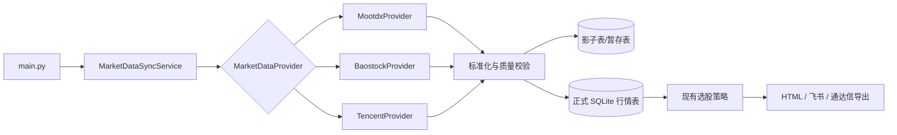

# Sequoia-X 行情数据源替代方案

更新日期：2026-09-09

## 结论

不让一个第三方项目整体接管 Sequoia-X。现已找到包含原 easy_tdx 历史的保存 fork，但仍把它作为可替换的行情 Provider，而不是把策略、报告和推送迁入该项目。

推荐采用可插拔的数据源架构：

- 固定提交的 `easy-tdx` 保存 fork 和 `mootdx` 作为第一轮通达信日线候选源，先影子运行，验证通过后再允许切换。
- 现有 `Baostock` 暂时保留为历史数据源和对照源。
- 腾讯行情接口用于股票名称、最新行情、市值、换手率、涨跌停价等补充与交叉校验。
- 参考 `a-stock-data` 的多源降级方法，选择性移植接口和质量校验，不把整个 Skill 当成 Python 依赖。
- `eltdx` 只作为个人、非商业研究环境下的可选实验源，不作为默认依赖。
- `Hikyuu` 以后可以作为独立回测研究工具，不嵌入当前数据同步主链路。

## 候选项目比较

| 项目 | 定位 | 优点 | 主要问题 | 对 Sequoia-X 的建议 |
|---|---|---|---|---|
| [zliujinxin/easy-tdx](https://github.com/zliujinxin/easy-tdx) | 原 easy_tdx 历史的保存 fork | 功能与原方案匹配；可验证的原作者提交历史；MIT 文本 | 直接父仓库不是原作者；HEAD 含两个第三方未签名提交；无 tags/Releases；PyPI 已下架 | 可以固定到审计提交作为 Provider 候选，禁止跟随 `main`，详见 fork 审计 |
| [mootdx](https://github.com/mootdx/mootdx) | 通达信在线/本地行情读取 | Python 接口简单；返回 pandas；支持日线、分钟线、指数和本地 `vipdoc`；MIT | 核心代码自 2024 年后基本停止更新；底层依赖 `tdxpy`；主站可能连接成功却返回空数据 | 第一轮主候选，但必须固定版本、做健康检查和多服务器切换 |
| [eltdx](https://github.com/electkismet/eltdx) | Rust 驱动的通达信协议库 | 功能最完整且更新活跃；股票/ST/停牌清单、实时行情、K 线、复权、F10、题材、市值和涨跌停数据较齐 | `ELTDX Research-Only License` 明确限制为个人、非商业研究；项目较新；部分平台需 Rust 编译 | 个人研究可试验，不能作为公开项目的默认核心依赖 |
| [a-stock-data](https://github.com/simonlin1212/a-stock-data) | 多源 A 股数据方法集合 | Apache-2.0；覆盖通达信、腾讯、百度、东财、同花顺、巨潮等；有备用源思路 | 主要交付物是 `SKILL.md` 和内嵌代码，不是稳定的可安装数据 SDK；公开接口仍可能变化 | 作为接口实现与容灾设计参考，按需移植经过测试的模块 |
| [Hikyuu](https://github.com/fasiondog/hikyuu) | 完整量化研究和回测框架 | 活跃；Apache-2.0；数据导入、指标、组合、资金管理和回测齐全 | C++/Python 体系较重，依赖多，与现有策略和存储层大量重叠 | 后续独立用于回测研究，不作为轻量行情 Provider |
| [pytdx](https://github.com/rainx/pytdx) | 原始通达信协议 Python 库 | 协议实现成熟，许多项目以它为基础 | 原仓库已归档，长期维护风险高 | 不直接接入 |

## 为什么首选 mootdx 仍然需要保护层

`mootdx` 和 easy_tdx 一样会受通达信主站可用性影响。TCP 连接成功不等于数据有效，空表、旧交易日、错误市场映射都必须视为失败。因此 Provider 返回数据前至少执行：

1. 结果非空，字段齐全，代码与请求一致。
2. 日期单调、无重复，最后交易日没有异常落后。
3. 满足 `high >= max(open, close)`、`low <= min(open, close)`、成交量非负。
4. 用沪深各一只哨兵股票验证服务器，再执行批量任务。
5. 服务器失败时轮换候选地址；全部失败则保留本地旧数据并明确报错。

这些检查放在 Sequoia-X 自己的数据层，避免再次把项目生存和数据正确性绑在单一上游仓库上。

## 数据架构

每次同步只能指定一个行情主源。备用源用于整批失败后的重试或对照，不能逐行静默拼接。每批数据记录 `provider`、`adjustment`、`fetched_at` 和 `batch_id`，使异常结果能够追溯。

## 复权口径

当前 Baostock 同步使用 `adjustflag="1"`，属于后复权。通达信在线 K 线通常先取得不复权数据；不同库对前复权、后复权的计算方式也可能不同。直接写入同一张表会在除权日制造假涨跌，并污染突破、涨停和 RPS 等策略。

新链路建议统一采用前复权作为策略分析口径，因为最新价能与实时行情对齐。实施时新建独立行情表或新数据库，完成全量重建后再切换；不得把新前复权行追加到现有后复权序列。

影子校验应同时保留不复权原始值和复权因子，并对近期分红送转股票单独抽样。只有双方转换到相同口径后，价格误差比较才有意义。

## 实施阶段

### 阶段 1：Provider 抽象，不改变现有运行结果

- 新增 `MarketDataProvider` 协议，统一股票列表、日线、名称和健康检查。
- 将现有 Baostock 逻辑移入 `BaostockProvider`。
- `DataEngine` 只负责同步编排、质量校验和 SQLite 写入。
- 默认仍使用 Baostock，现有命令保持兼容。
- 对 Provider 使用伪造数据做离线测试，不让测试依赖公网。

验收：现有本地数据库、策略、报告、飞书和导出结果不变。

### 阶段 2：mootdx 影子验证

- 固定 `mootdx==0.11.7` 和经审核的底层依赖版本，不自动跟随最新版。
- 新增 `MootdxProvider`、候选服务器轮换和哨兵检查。
- 新增 `--check-provider mootdx`，只写暂存表和校验报告。
- 抽样至少覆盖沪主板、深主板、创业板、科创板、北交所、ST、停牌和近期除权股票。
- 对比 30 只以上股票、至少 250 个交易日的日期、OHLC、成交量和成交额。

验收：无空数据被判为成功；日期覆盖率、异常行、复权差异和单位换算都有明确报告。

### 阶段 3：新库重建与可控切换

- 建立统一前复权行情库，同时记录原始行情和复权信息。
- 配置 `DATA_PROVIDER=baostock|mootdx`，命令行显示本次实际数据源。
- 先对少量股票运行，再进行全市场回填。
- 失败时不覆盖已验证数据，不在同一批中自动混入另一来源。

验收：连续多个交易日同步稳定，策略结果能够追溯到数据批次。

### 阶段 4：腾讯补充数据与交叉校验

- 股票名称、最新价、市值、换手率、涨跌停价格优先使用轻量接口缓存。
- 用最新价和交易日校验通达信日线末行。
- 设置缓存有效期和请求节流，接口失效时不影响离线策略运行。

### 阶段 5：回测与策略升级

- 先记录每天每个策略的入选结果及其后 1、5、10、20 日表现。
- 为涨停、停牌、ST、不同板块设置 A 股实际成交约束。
- 需要复杂组合回测时，再把标准化数据导入 Hikyuu，作为独立研究流程。

## 第一轮开发范围

第一轮只完成阶段 1 和阶段 2，不立刻替换正式数据源，也不引入 Hikyuu。这样可以先回答三个关键问题：

1. 当前网络能否稳定连接通达信主站。
2. mootdx 的日线字段、成交量单位和复权结果能否与现有策略匹配。
3. 新链路是否真正减少 Baostock 超时和限流问题。

验证通过后再进行全市场数据迁移；验证不通过时，Provider 接口仍可直接接入下一个候选源，不需要再次改写策略、报告和推送模块。
